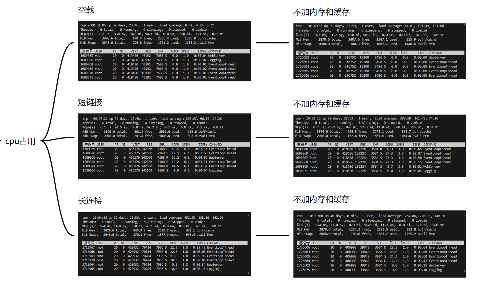

# Webserver
Tiny Webserver

---

以下是对内容进行模块化整理的版本：

---

### WebServer 设计与实现

以下是将内容分为并发模块、日志系统、内存池、线程池、LFU 缓存和数据库进行总结的版本：

---

### 1. 并发模块
- **EventLoop**：
  - 封装了 epoll 和 loop 函数，负责处理待执行的回调函数队列，并使用 wakeup 套接字异步唤醒。
- **Channel**：
  - 封装文件描述符（fd）及其感兴趣事件，处理 fd 上的事件。提供设置和获取 fd 的感兴趣事件函数、处理事件的回调函数，以及 `handleEvent` 函数。
- **Epoll**：
  - 封装红黑树操作函数、`epoll_wait` 函数和定时器处理函数。负责监听文件描述符事件并返回触发事件的文件描述符。一个 Epoll 对象对应一个 IO 多路复用模块。
- **Thread 模块**：
  - 封装线程的启动（`start`）和等待（`join`）函数。创建线程的 data 结构体保存线程信息，利用计数器锁存器确保线程启动后主线程继续执行。

### 2. 日志系统
- **Logstream**：
  - 将数据转换为字符形式并存储在字符数组（`bufferA`）中。每个 Logstream 仅持有一个缓冲区，并重载 `<<` 操作符。
- **Logging**：
  - 封装 Logstream，创建 Logger 持有 Logstream。析构函数将当前 buffer 内容写入异步日志类。
- **AsyncLogging**：
  - 异步日志类，使用双缓冲区方法（`bufferA` 和 `newbuffer`），将日志数据放入后端缓冲区，使用条件变量和计时器控制写入操作。
- **Logfile**：
  - 提供 `append` 和 `flush` 函数，将内容写入内核文件缓冲区以及最终写入到文件中。

### 3. 内存池
- **MemoryPool**：
  - 创建 8、16、...、512 共 64 个内存池数组，每个内存池存储 4096 大小的块。块内部分为不同的 slot，用于管理内存块的分配和释放。
  - 使用 slot 结构体存储指针，并将使用过的内存块链表化管理。

### 4. 线程池
- **EventLoopThreadPool 模块**：
  - 提供启动每个线程的函数和轮询函数。启动线程后保存到 EventLoop 容器和 EventLoopThread 容器。
- **EventLoopThread 模块**：
  - 封装线程和 EventLoop，创建线程的启动函数及线程的回调函数（运行 loop）。

### 5. LFU 缓存
- **LFUCache**：
  - 初始化静态缓存实例，保证键值对一致性。包括两个哈希表：一个存储 key 对应频率链表的头结点，另一个存储每个 key 对应的小链表结点。
  - 插入键值时，根据大表验证是否存在。更新频率表，创建新的频率表和小链表以管理缓存。

### 6. 数据库
- **CGImysql**：
  - 初始化数据库连接池，预先创建连接池列表，保存设定数量的数据库连接。使用单例模式获取连接并执行 MySQL 指令验证用户身份。
  - 使用信号量防止并发连接超出连接池上限。

---

### 7. 性能测试
- **LFU 短连接**：
  - **测试结果**：速度: 15645 请求/秒，1658370 字节/秒。请求: 938701 成功，173 失败。

- **LFU 长连接**：
  - **测试结果**：速度: 64119 请求/秒，10130829 字节/秒。请求: 3847156 成功，0 失败。

- **无 LFU 短连接**：
  - **测试结果**：速度: 121898 请求/秒，1499625 字节/秒。请求: 716340 成功，259 失败。

- **无 LFU 长连接**：
  - **测试结果**：速度: 43383 请求/秒，6854374 字节/秒。请求: 2602926 成功，0 失败。

### 8. CPU 和内存占用
- **功能**：
  - 测量服务器在不同负载下的 CPU 使用情况。

这种模块化的整理方式有助于更清晰地了解每个部分的功能和实现细节。

---
